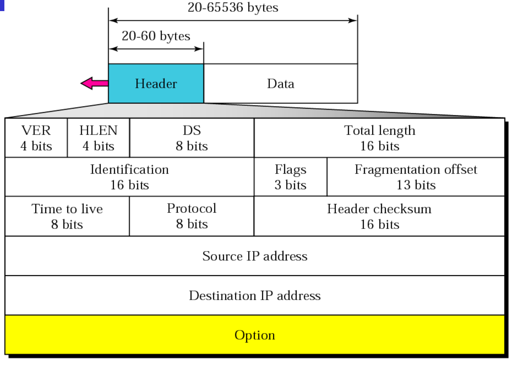

From 

3 actors
  -Resource Owner : the end user
  -Client         : The application
  -Authorization Owner: The party that stores and controls access to the resource being sought by the client

Flow

Request access from Resource Owner for resource (//grant access to google contact list)
On approval client sends a request to authorization server w scope as the resource in question
Resource owner logs into authorization app and asked to approved client request for the resource
On confirmation authorization server sends the auth code to the client
The client uses the auth code in addition to the secret key access the resource

Open ID Connect
Adds authentication standard to Oauth2.0
